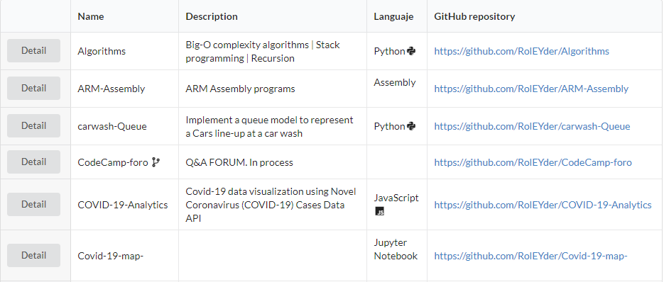

# ProjectManagement-MERN 


</img>


#### Simple MERN App to view all repos that you have on GitHub.

  


#### Releases:
  - v1.0.0   


### Stack


* [ReactJs](https://es.reactjs.org/) - A JavaScript library for building user interfaces.
* [MongoDB](https://www.mongodb.com/cloud/atlas/lp/try2?utm_source=google&utm_campaign=gs_footprint_row_search_brand_atlas_desktop&utm_term=mongodb&utm_medium=cpc_paid_search&utm_ad=e&gclid=Cj0KCQjwz4z3BRCgARIsAES_OVcbo-8IWTVG1v9pPt5yOU7D8kM_4hPm9TZ8WXGs2_893i4n_sE_o_4aAvDoEALw_wcB) - Cloud-hosted MongoDB service on AWS, Azure and Google Cloud. Deploy, operate, and scale a MongoDB database in just a few clicks.
* [NodeJs](https://nodejs.org/en/download/) - As an asynchronous event-driven JavaScript runtime, Node.js is designed to build scalable network applications. In the following "hello world" example, many connections can be handled concurrently. Upon each connection, the callback is fired, but if there is no work to be done, Node.js will sleep.
* [Express](http://expressjs.com/) - Fast, unopinionated, minimalist web framework for Node.js


### Installation


Install the dependencies and devDependencies and start the server.

```sh
$ git clone https://github.com/RolEYder/ProjectManagement-MERN.git
$ cd ProjectManagement-MENR
$ npm install install
$ npm start 
```


License
----

MIT


**Free Software, Hell Yeah!**

[//]: # (These are reference links used in the body of this note and get stripped out when the markdown processor does its job. There is no need to format nicely because it shouldn't be seen. Thanks SO - http://stackoverflow.com/questions/4823468/store-comments-in-markdown-syntax)


